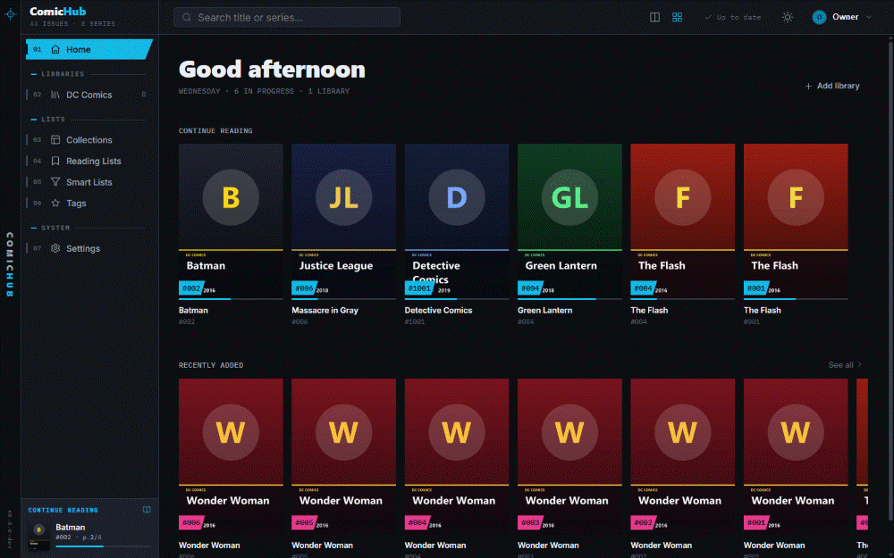
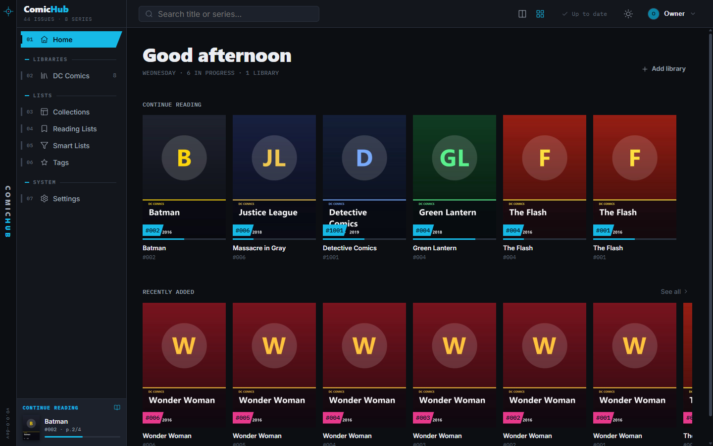
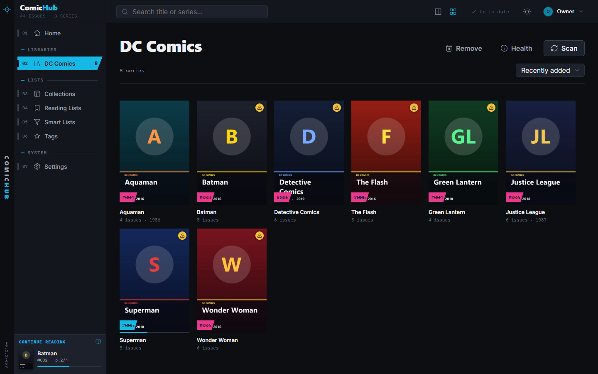
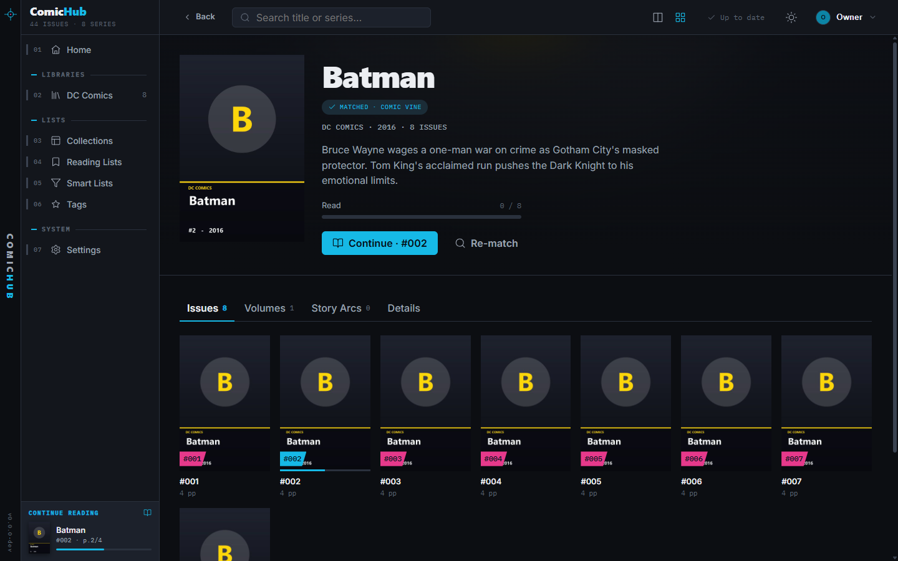
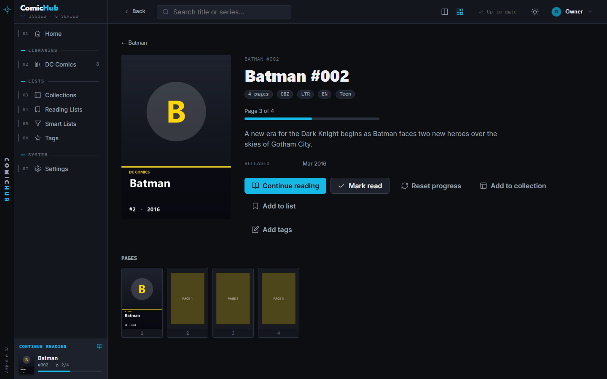
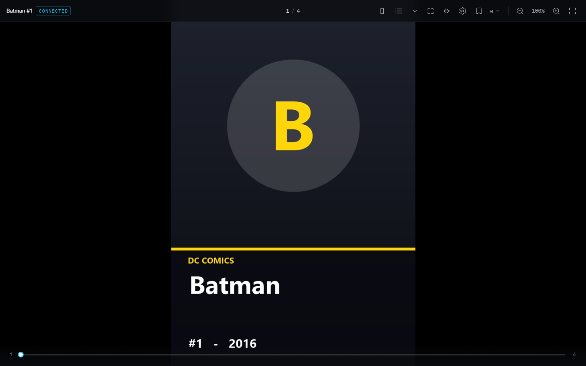
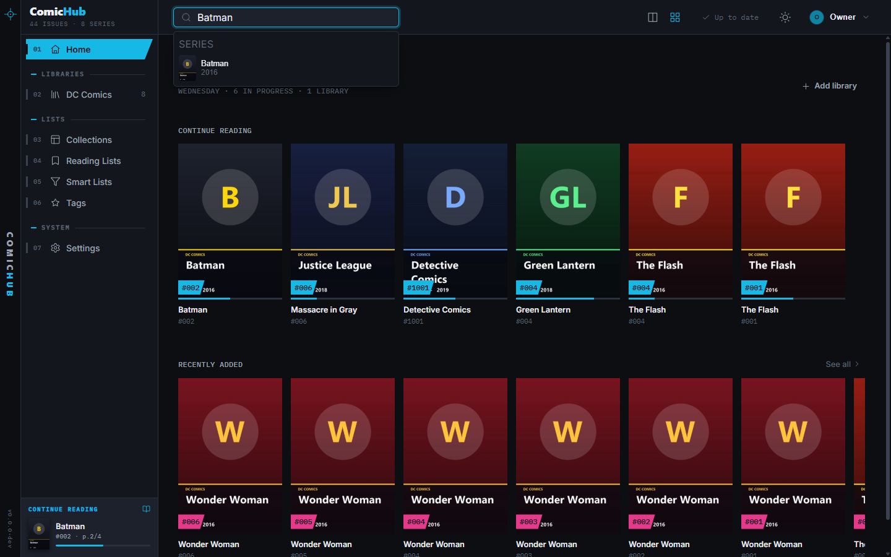
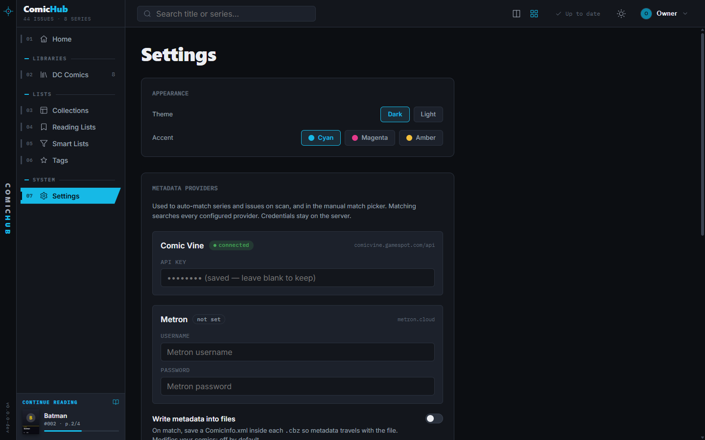

<div align="center">


# ComicHub

**Plex, but for comics.** Point it at a folder and get a clean, browsable, richly-tagged
library — with a fast, comfortable reader that opens any issue in one click.

_Local-first · works fully offline · open formats · your files stay yours_



</div>

---

## What is ComicHub?

You have a folder (or a drive, or a NAS) full of `.cbz` and `.cbr` files with messy names
and half-filled metadata. ComicHub turns that pile into a real library: it scans your
files, groups them into series, pulls in cover art and metadata, tracks what you've read,
and lets you actually sit down and read — remembering exactly where you left off.

It's three cooperating pieces, shipped together:

- **📚 The library** — browse and organize everything: series, collections, reading lists,
  smart lists, tags, and search.
- **📖 The reader** — a first-class reading experience with instant page turns, single/double
  page, fit modes, RTL for manga, zoom, and resume.
- **🗄️ The server** — a single Go binary that owns your catalog, thumbnails, and progress. It
  runs invisibly inside the app, or on an always-on box for the whole household.

> **Everything below is real UI.** The screenshots are captured from the app running against
> a demo library.

---

## Take the tour

### Home — pick up right where you left off

Your **Continue Reading** shelf and everything **Recently Added**, the moment you open the app.



### Your library, at a glance

Every series with its cover, issue count, and year. Scan, check library health, and sort —
all from one place.



### Series detail — the whole run in order

Cover art, publisher and year, a read-progress bar, and a **Continue** button that jumps to
your next unread issue. Tabs break the series into Issues, Volumes, and Story Arcs.



### Issue detail — everything about a book

Page count, format, language and age rating, the summary, release date, and one-click
**Continue reading** — plus add-to-collection, add-to-list, tagging, and mark-as-read.



### The reader — built for comics

Single or double page, fit-to-width/height, LTR or RTL, keyboard + mouse navigation, a page
scrubber, zoom/pan, bookmarks, and aggressive prefetch so page turns feel instant. Your
progress syncs straight back to the library.



### Find anything, instantly

Type-ahead search across series and issues — sub-100ms on a cached library.



### Settings — make it yours

Theme and accent color, metadata provider credentials (Comic Vine, Metron), and optional
write-back of matched metadata into your `.cbz` files as `ComicInfo.xml`.



---

## Features

|                                      |                                                                                                                                                                    |
| ------------------------------------ | ------------------------------------------------------------------------------------------------------------------------------------------------------------------ |
| **Effortless library**               | Point at a folder; get a deduplicated, metadata-rich library. Live scan progress, incremental file-watching, and move/rename reconciliation by content hash.       |
| **A reader that's a product**        | Instant page turns, single/double page, fit modes, LTR/RTL, zoom/pan, bookmarks, continuous (webtoon) scroll, resume, and per-book overrides.                      |
| **Organize at scale**                | Collections, personal reading lists, free-form tags, and **smart lists** (saved rule-based queries) built for tens of thousands of issues.                         |
| **Metadata that fills itself in**    | Reads `ComicInfo.xml`, falls back to filename heuristics, and matches online against **Comic Vine** and **Metron**. Optional write-back keeps your files portable. |
| **Reading you can trust**            | Per-page progress, read/unread state, Continue Reading, and completion stats that are always correct — never lose your place.                                      |
| **Multi-user & remote _(optional)_** | Run the server on an always-on box; each household member gets their own accounts, progress, and lists, with age-rating content restrictions.                      |
| **Local-first & open**               | Works 100% offline on one machine out of the box. Standard archive formats, standard metadata, no lock-in, no DRM.                                                 |

### Supported formats

| Format  | Container | Read | Metadata        |
| ------- | --------- | :--: | --------------- |
| **CBZ** | ZIP       |  ✅  | `ComicInfo.xml` |
| **CBR** | RAR       |  ✅  | `ComicInfo.xml` |
| **CB7** | 7z        |  ✅  | `ComicInfo.xml` |
| **CBT** | TAR       |  ✅  | `ComicInfo.xml` |
| **PDF** | PDF       |  ✅  | PDF info dict   |

Page images: JPEG, PNG, WebP, AVIF, GIF, BMP. Double-click a loose `.cbz` and the reader
opens it standalone — no server, no library required.

---

## Getting started

> ComicHub targets **Windows first** (Tauri desktop). It's early software — see
> [project status](#project-status) below.

**Prerequisites:** [Go 1.23+](https://go.dev/dl/), [Node 20+ / pnpm 10+](https://pnpm.io/),
[Rust stable](https://rustup.rs/) (with WebView2 on Windows).

```sh
# 1. Build the media server (the app runs this for you as a bundled sidecar)
cd server && go build -o bin/comichub-server.exe ./cmd/comichub-server && cd ..

# 2. Install the desktop app dependencies
pnpm install

# 3. Launch ComicHub
pnpm dev:client
```

Then in the app: **Add library** → pick the folder your comics live in → watch it scan →
start reading.

**Reader on its own?** `pnpm dev:reader`, or (in a packaged build) just double-click any
supported comic file.

---

## Project status

ComicHub is built in shippable phases. Today:

| Phase                        | What it delivers                                                                     |     Status     |
| ---------------------------- | ------------------------------------------------------------------------------------ | :------------: |
| **1 — Browse + Read**        | Scan, browse, one-click read, never lose your place                                  |    ✅ Done     |
| **2 — Library platform**     | PDF/CB7/CBT, online metadata, collections, smart lists, tags, search, library health |    ✅ Done     |
| **3 — Multi-user & remote**  | Accounts, roles, content restrictions, remote server                                 | 🚧 In progress |
| **4 — Polish, scale, reach** | Mobile clients, manga niceties, advanced reader, import/export                       |   🔜 Planned   |

See the [roadmap](docs/08-roadmap.md) for the full plan.

---

## Documentation

Deep-dive specs live in [`docs/`](docs/):

| Doc                                              | Contents                                                 |
| ------------------------------------------------ | -------------------------------------------------------- |
| [00 — Overview](docs/00-overview.md)             | Vision, goals, personas, glossary, non-goals             |
| [01 — Architecture](docs/01-architecture.md)     | System architecture, deployment, process model, security |
| [02 — Data Model](docs/02-data-model.md)         | Entities, SQLite schema, relationships                   |
| [03 — API](docs/03-api.md)                       | REST + WebSocket contracts                               |
| [04 — Media Server](docs/04-server.md)           | Scanner, formats, image pipeline, metadata, jobs         |
| [05 — Client](docs/05-client.md)                 | Screens, navigation, state, IPC                          |
| [06 — Reader](docs/06-reader.md)                 | Standalone vs connected, rendering, modes, prefetch      |
| [07 — Design System](docs/07-design-system.md)   | Visual language, tokens, components                      |
| [08 — Roadmap](docs/08-roadmap.md)               | Phased delivery plan, MVP definition                     |
| [09 — Tech Decisions](docs/09-tech-decisions.md) | ADRs and rationale                                       |

---

## Contributing

ComicHub is a monorepo: a Go server (`server/`), a pnpm workspace of TypeScript apps and
packages (`apps/*`, `packages/*`), and Rust inside each `src-tauri/`.

Working on it? Start with **[CLAUDE.md](CLAUDE.md)** — it captures the build commands, the
definition of done (matching CI), the design-system sync workflow, and the conventions and
gotchas that aren't obvious from the tree.

---

<div align="center">
<sub>Built for people who love comics and want their collection to feel like it.</sub>
</div>
